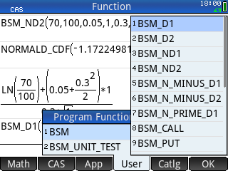

# HP PRIME Black-Scholes-Merton

A library of Black-Scholes-Merton functions for HP Prime calculators 🧮

## Installation

Using the [HP Connectivity Kit](https://www.hpcalc.org/details/8938), drag and drop the [BSM.hpprgm](Calculators/Prime/BSM.hpprgm) file into the HP Prime calculator.

## Interactive Usage

Press <kbd>Shift</kbd>+<kbd>1</kbd> to open the `Program` menu on the HP Prime.

From there you can interactively run the `BSM` function that will display the results of the Black-Scholes-Merton formulas.

## Library Usage

If you want to run the formulas independently, press the <kbd>Toolbox</kbd> key.

Then, on the touchscreen, go to the `User` tab, click on `BSM`, and select the function of your choice from the dropdown menu.

This library contains:

- `BSM_D1(price, strike, rate, time, volatility, dividend)`
- `BSM_D2(price, strike, rate, time, volatility, dividend)`
- `BSM_ND1(price, strike, rate, time, volatility, dividend)`
- `BSM_ND2(price, strike, rate, time, volatility, dividend)`
- `BSM_N_MINUS_D1(price, strike, rate, time, volatility, dividend)`
- `BSM_N_MINUS_D2(price, strike, rate, time, volatility, dividend)`
- `BSM_N_PRIME_D1(price, strike, rate, time, volatility, dividend)`
- `BSM_CALL(price, strike, rate, time, volatility, dividend)`
- `BSM_PUT(price, strike, rate, time, volatility, dividend)`
- `BSM_CALL_DELTA(price, strike, rate, time, volatility, dividend)`
- `BSM_PUT_DELTA(price, strike, rate, time, volatility, dividend)`
- `BSM_GAMMA(price, strike, rate, time, volatility, dividend)`
- `BSM_CALL_THETA(price, strike, rate, time, volatility, dividend)`
- `BSM_PUT_THETA(price, strike, rate, time, volatility, dividend)`
- `BSM_VEGA(price, strike, rate, time, volatility, dividend)`
- `BSM_CALL_RHO(price, strike, rate, time, volatility, dividend)`
- `BSM_PUT_RHO(price, strike, rate, time, volatility, dividend)`

## Development

Contributions are welcome, just make sure it still passes the [Unit Tests](Calculators/Prime/BSM_UNIT_TEST.hpprgm).
